# PicturaIO Image API Reference

Once your servlet is configured and deployed, you can begin making requests.
All PicturaIO image requests have the same basic structure:

<div style="text-align: center; margin: 2em;">
    <img src="data:image/png;base64,iVBORw0KGgoAAAANSUhEUgAAAkUAAACCCAYAAABIDLzkAAAg7UlEQVR42u2dC7hWU/7H3+dMTkcdke6SFFLJoZR0QyolySklSUQkRZJoXHJyiSMpKaUopRvdbxJJElH/XGcYjCbGGNOYx2P6G3//+c886//+Vmu/s97V3vvd77m+pz6f5/k97eva6/rb3/1b6z3FYgAAAAAAAAAAAAAAAAAAAAAAAAAAAACQmp3f7SzAsKJaUL/6+z+2FxxOFlQP6r0tBRiWaRbUX9d/++8CrHgWVLcffL6n4HCyCiuK3v3zToVhRbWgfvXjT9vV4WSBomj3awrDMs2CRdG/FFY8CxRFn32pDidDFGGIIkQRoghDFCGKEEWIIgxRhChCFGGIIgxRhCjCEEWIIkQRhijCEEWIIgxRhChCFGGIIgxRhCjCEEWIIkQRhijCEEWIIgxDFCGKMEQRhihCFGEYoghRhCGKMEQRosi2rb9/45B94R/KZUMUIYowRBGiCFGEKCphUXREdrba/vVbZfYSvmX8KLX0jRcC90v4hV9m5drxp3dU646t1YYPXjosRdGDE0eod3cvDDz/w/5t6tzzWqnPvlyDKIrbY7cOU58sm6u3H79tuLo+v2fC5t03NvC+wluuVx8smZ3Yl+2Rl1+adM1T40apHfOeDE3bOz6s78XqoRHXqt0LZyal4Z2/qd8l6tnxt6u/b1sXWIbfrXhOX3fFhZ3VbVdepvfDyp5uGd6aO00NuaS7urLHBWr15PsT1/x180p168C++vjzD4xLuj/sXHHq37XrevdQn6+a71t3RUmvPEXRdeMfVTO3fqzWffNPldehs1rwwTcZIVLKOj8lJYpeWL1eXXn1EHVRr95q7F33FFmcbNv1nrpqyLVq3atbko4/t+RF1bvPZTr9KTNmJY5PfOxx1Su/jz7+yONTEUUlLYquGnGVemb9s4H76dim32xSxxx7jBYQfvsVWRSJjX/iPvX2H3eU+nOK0walIYq+/Gq9qlHjaC18wq6bNftu9bcf3wi9ZtTogerVLbMOaVEkL+yaxxyt/r1rs97venYrNe6aK9QLD9+r7d350wPvFfFw79BBiX2574hKlZKESO34mNr1/FOhadvHRSBUr3aUevOZqYk0vPNLJt6txc6pDRuo/9v5ykFlkH/l3mljR6r1Ux9SU8fclCR4iluGP29apjqe2UKtnfKATv/42rXU5pmT9DVnn9ZUTRh2tXr5yUfUOac302Xx7g87V5z6t+2NOVPUkZUrq7uvuzLpeFHTK09RtOjj71S1Y2tqASL7o5+Yp9Z8/UvGRG/KMj8lJYoeKJykJjxcqKY9PUe1bd9BjRw9Rh+/ZugNasELyyOlsWztBnVKk1NVnbp11dxFSxPHN2/foVqe1Vo9MXO2Tl/OPz1vgXr+xZVaEE2f/aw+3uikk3Q+EEVpiqK1u9epYXcMU8PHDU+KdMiLt3rN6ura0depp5bPPGhfrnlg5oP6Hrn/1oJb1ebfvZaInAwcNjApvdH336b6X3d54L6X1vW335BIa9GWxWrwyKvVnYXjEoLjsfmT1fr3NyTuW7NrrZq1cpaeLpM05X455ieK5Bn9ru2nHp03Ke3nislxqSc55wqT+2fcnxB4kubGj172rVc3P0HXSVp3P36PunL4oMSz/NqgvEXRI4/eom4cfpnefva5Ah0NuvveoWriIzerr/60MXHdnLnjE8JJ/pVrbxjWNyGWRAzVqlVd3THuGrV+4zR93dPP3Jv0LHt/3oIJ6g9/3KCf9cLyR/Wxt9+dr+697wY1esygtMRVWYoiEQ63DMhPeom+NG1ipHtXTpqgzm2Vl/Tyl2jFrLtu1ft/fGmpflGnSts9LpGYsDyJiBCB4ZZBrrHzUxplsE0iUmIfLZ2jGtevlzguQknEk2yHnStu/dsmUSBJ64S6tUPrtiJMn10/4XF1yXU3J/Zvn/58QiDd8dQiHaW58vb71NCCx9TST79X01/7QPUbeacaUfhUQqzIscHjHtDHH1v3VlL6c97+TA26Y4K2MdPm6/S9KNCoyXNUnxvHHHSPbX75kbS8/KR6TnlPn0kk54JuF2oxdGyNGuqGm0aqOQsWpbxPIk0ScXJFkWv9Bw7S5h6/7c5f62gSoihNUdShawf10NMPaRHToFGDxDkRGlVyq2ix8PTq2Qfte/ef2/3cxP3NW56mj7+5d7uqnFM5cZ3YKc1PUc9vXhi4L2l1vrizmjj7YdXt0m46rS6XdNH7Lc9pqSMkct2A6weom+4akbgv/6p8NfKekXr6SrYLny1U5190/kGiSNLu2b+nTk+2PUEW9bliIlAKnpygTaJcIpL8om6y3bFbJ996des/6DrJk5RHztVrUE89sfgJ3zYob1HU4vST1fYd8/R25cpHqJ69OmrBMuLmy9VZrZslrpNzf/3hdb3do2cH1b1HOy1ybh51hT720qbpKjdetl/ffZ16+dUZnlhxxUtiO+fIyqr/5d1U4WO3qt0fLtHHJC1JU0yiVyKSMk0UndHkpKRoit9LVCIMIkRc++831+uoikRtZLtujWN1hOeyCzol7vO2o4qi/9mxUQsTLwLjd59EbiQy4pZBoi5Vj8xJijKF5V/OpVsG2/p3PU9PRy0rHJ90jZShcvYRejvsXHHr3zsveT86t6rO/wVtWibVTUUURY2a56lpr76X2D8iu7Ja/dXPie32F/dV42a/oM69dIBqcmYb1bFXP73f4pxOqu9NY/V1ImxEiIhJ1ElEkhxf8eV+dWyd49Sds5boc0fmHqXumbtSn5N0e1x1gz5Xu8GJasKil3zz5+anbffe+p5Lbxit85PqOeUtiq646mo1/OZR6tmFS1TVqlX1toicwinT1DHVqx9k7v1yLEwUdetxkY5K2cfe2v2hanZaCx01QhSlKYrmbpiX2K90RCX1xp5tiX158dsvX3ffvV9e3va+HWE5qdlJgftuWhK9yvpVViIvEh0S8SbbIqTse2vUrqGmLnpC5VbLTRybv2lBkih68c0Xk86LeJHnvfLJq5Gf65oIKIkOBYmisHpNVf/L3lquy2VHoUQk+bVBeYoiER3NT2ucJHxe2zo7sX9Cw7qJfU8UvbNrgTrmmKN8p9tEyHiCKJUokvSWrZwUmLfL+nXR0alMEkUSxTj95EYHCZTu7Von1qB4U19BJtNB8tKViIusmZFpIHlBy7+yRkiiF3baEnU5qkoVbXKPe1xEjUw1uXmSYzJlJdNdLU89OTHd5JZB8iLTWhL9ef3pyZHqIZ0yeCb1IhEgETmyTkim9RyhoP8NOxdU/351FGYyrXjpee31tqy5kkhXcdIrT1Ek4uXEpi1CRcjkDTv09nP/tTfuH3+lBYjs3/vcatWmS8+D0hTx5EVpChauV63OvzBx7rhGp6ipL+9ST2//VFWvXTcpGiQiKYoo8vIjJmJK9oOeU96iaOiNN6n2HTupXb/5XSSB42dh9yxavkod36CB2vnRJ3pfrvPE1YhRo1lTVBRRJFEde9/+1VYUUWTfLwJCIizucyQKIlNTQftuWpKHI6scmTg3ZeHUJHEiokgWaM9ZO0edcfYZejrMPi9TXrYocs+LyTSURF/See4dD9+hI2P1G9bXERuJGAWJorB6TVX/kl/ZlvoWE0HX7oL2GSeKJBok02S2UPnL37Yk9iUaNH/hA0miaPHSh/Vxv/TSFUX2s8QmTx2jI1UnNjpOR53c6bfyFkWyEFkW4oatQZHpo9+vXqBftq55a3DERKwsevAufUwiI7Ig+axmTZJEVZRIkUQ7Ljm3nV5wbZ8XkSOCRdYcyTVhZRAxIxEciSiJCAjLf7plEPtq/WItiLwIj9wjUSP7+b/Kykp5Lqj+3TpKlf+LO7bV0bWrL+6m+nTuqEXQ/76zqUJGiiTaItNQYSJk5R9+0tvLv/hR5VSpmrhOhIgnim56eLqO4NRt2FhHaSRaI8dlqksiOCKontnxhY4iSdoSxZG0ZV+s6lFHq7Mu6BFJFHn5EZPnS9Qq6DnlKYpkjc/pZ5yp3vv0C1+BI4unCx565CCLKoo2vr5NCyKZYnPPybqj7hf30qIMUVSMhdZFEUWyJsbbb9Pp7KT1Ot7aGIl6eNe5+355kTyI6AgSJ7J2aMioIVpciVCRiI6II++8CA1bFMn9TfOaJj1P0peyRH2uCKjGpzbW0SXZ796ne6goCqvXVPU/ecHj6vTWeb5tlimiSCI9deocq774w9okoWLvn9+5tRZBtiha+uIjqm3bFmmLInmeK4q86TixFasnq6bNGul1RrIvU2uZJIrk5SxTRX95dXnKl/KetQt1xMM1OSdreySy1D7vNPWnjS8kfq113w2DddQnyvoW97iIMXnRp7ovqAz2r8ZESIXlP90yyBTdKSfUV6/MKExaJ2SvS5JF2iLIws6VVP1LfiQCJL+E80yeN3/CnRVOFMk6HYnWLPzw21AR4m2LKBLB44oimfY64dTmaslv9+nj5/UZmBBFYrLWqPnZHfRxL8pz34K1qlnrdpHy6ebHzu+Znbokpsn8nlOeokiiOO7aIVvgrN+8VT306OSDLIooen3HLnVCwxPVzLnzA58vi69r1KyFKCpJUSTTYdNfnB64L9eLKJFtWSRsiySZ8hEB4Qoad78ookh+uSZrkk485UT9DFkcLWuYvIXKIlZsUSQiSaItK99ZlZi+E2EmAi3qcyVNWf/jXSfRoqKIIq9ewq6TKTTJ7+LXlyTOeWVz26C8RJFMXbkRHxEqEq2RbVlwbYskT8R8890mHcXZ9f6ihNixp9vWrJ+a2K9SNSdxnaxTChNFIoBkrZJsf7vvVR0tyiRRJC9KW3gUdQ2Kt56lWaMTkl788gsxiVqkK4okPbnP/ll80H1uGURg2L9Kk0XQ7q+xilOGH15frdcAya/P/MSZRHRkX8SUPDvsXEnVv0zt2dNlYiKMJJ2KJorsSE9xRJEIoLO79UpcI9EiWxQdXbO2FjJ25Eam4CQ6NGPLR4lj3s/uZSrNE1h++ZGolHe9LZL8nlOeomj5+o16HZF97Lj6x2uxUpzpM/mZfpOmzfSvz+zrRGTZUalhI29R53fpiigqSVEkC5pl8a8sXPbbl+tlMXCr9q30dJQnkLxIjYgKWbQsi4W9NN39oogiMREo3pSS2L1Tx+soiiy4lgiSPQ0mNm3pk6pu/bo6HVtYRH2uiD25TxZfS1RKnpGuKLLrJVX9S35r16utI1wikCQ65tcG5SWK8vt01kLFFUVDruutOnZqqX9J5gkkV8TIlJqcP7Plqfpf75r7JgxTJ510vOrV+9zEL9tk/ZH8jaOrh/RKutYVRSK+RFS173CGOqddnp7ayyRRJFM69k/Di7Mw11uDZB8TIeCuxZG0ZVGzLDQW817m7pqiq3p21QIkVZ7cMkhURtKRSI6InIvan52UTnHLINEZaQYv/2LegmdZ7yTbMo0l64TsCJDfubD696ujIJPpPXftlCfyJOqVbnrlKYpkwbQsTC6uKBIhImt7ZOG1RGpkSs4TRXKPTIvlHl1dW3bOkfpXa3LugSUvq5r1jlcn57XSAkl+BSdTY9LmknZQfmRx9untztMiyBNIYc8pL1EkvwiTxc72sVvGjNURHvk1WlFFkUSTpI6y4+8Lz+SaceML9EJuWcMk4qtVmzbqlW1vI4pK2uSlbf8tIXvfe6mLuX+jx/t5fmmZ/JJM/jaQO1WX6o9R+i14TsfsNUBFsXTrRfLr/i0nt00y5S9ae0JFLNXfJBJz1wSJyb129Ei2bfFTlDT5i9ala/9466WkiFFZmUSFZOF1uuf4i9alY/ZaH8+6XXGtunXKs4n9uTv3aCFkXyNRI+8n92L2z+yDRJqY/beLojynrEXR7k8+178Cc4/Loms7olPS9s6Hv9HP5i9al4OV9V/E9oSPLLKW6a+yfjb/zUc0UcR/84Fh/Dcf3s/uRz46K7GGSRZ1y4LsqGue5A9Lyi/ePNFkC6SSeg7/zQeiqMSsZp2aZS5MZKquSYtTS2xdDaKo5ERR3Xo1EUUYhihKitjINJ38Mkz+HtLFQ0ZooRPl3onLX1O16p+gbnxoWuKYpOMniorzHEQRogjD+A9hEUUYoghDFCGKMAxRhCjCEEUYoghRhGGIIkQRhijCEEWIIgxDFCGKMEQRhihCFGEYoghRhCGKMEQRogjDEEWIIgxRhCGKEEUYhihCFGGIIgxRdKiLop3f7SzAgq1Lry5bqYdgC+pXf//H9oLysPw+528tj+cGiqL3thRgJWP9up63lXooGQsWRf8uyGTr0Kvf1kzPY6Ao+nxPQXlY1x4XbS2P58bgkEVRBbQX0LZAH6DOAOhQtBfQtkAfoM4A6FC0F9C2QB+gzgDoULQX0LZAH6DOAOhQtBfQtkAfoM4A6FC0F9C2QB+gzgDoULQX0LZAH6DOAOhQtBfQtkAfoM4A6FC0F9C2QB+gzgDoULQX0LZAH6DOAOhQtBfQtkAfoM4A6FC0F9C2QB+gzgDoULQX0LZAH6DOAOhQtBfQtkAfoM4A6FC0F9C2QB+gzgDoULQX0LZAH6DOAOhQtBfQtkAfoM4A6FC0F9C2QB+gzgDoULQX0LZAH6DOAOhQtBfQtkAfoM4A6FC0F9C2QB+gzgDoULQX0LZAH6DOAOhQtBfQtkAfoM4A6FC0F9C2QB+gzgDoULQX0LZAH6DOAOhQtBfQtkAfAOoM6FC0F9C2QB8A6gzoULQX0LZAHwDqDOhQtBdVQNsCfQCoM6BDAe1F2wJ9AGwmUAVAh8JpAmMRGN8AADhNAGB8AwDgNAGA8Q0AADhNAMY3AADgNAEY3wAAgNMEYHwDAABOE4DxDQAAOE0AxjcAAOA0ARjfhxq5NDXQUQCnCYx/KM3xfWbcZsdtadymxO3kIqaTFbctcatXSuX8JW7ZIWV4pgTKUFKMMfmZGbehcatGN03NONOQdqPOcK4ZEbd2xegofsyNW5NS7gizzXZZdszSHpCIosxzMOXZ5gNNnsQGF/EFUxKOM53xj6NmfLvkx+0H867pafrIvri1iXj/JOcddU3cKpWxKCpuGUqDzXErNH5CfMFnpVgvhwwigB609qUC/xm3ptaxKA2bjlM8L24/x21iKXeEAXErMPkfVIZ1eg0d75AURWEOJkqbT4rwcZEu8sxVcdtgjb90nXNRHKdblnTGf0Vw1KXRVozvYL6JW3+fj/FtzgeAfHiMN326ujnezvRveY91NscGmY8V+94ZZmy4HxV1TJr3OB82eeZYYcS+HqUMg53zg50PavlImOzT9+RdVsPks1fcesetvnW+oXmv+o21ntb+93HrkaJ87rPCrvXapMBqkzxz3XBnXLcxx+8x12QsfZ1G22miOMPNfgMjYFI1nHSUxk7lBCFfiaPj9rVPB/Xr9KnOpeoIeSZ/tSIOkiiNHNRJ3AEZNuhwmhVPFAU5GLvNs6z+5YklP8cd5iDTcUwzzJhKxzkXx3H6leUX4yui9PNMctR+/syvfOm8sCqM88+Q8d3U9J8s57hMyf7LOi7XrDH1PcW8q7yP7P2mvTv5CJcVcVtgxoRsP+m8t9ZZaX5hnZtsxuRg00fzQkRR1DKokDqTvM02edlrjYmYeQcvjtuo2IEZlifidpd1Xu4bF2Gs7bPEU1D53GelqosVpm6XmjZZZva3mY8L4ay47THHh5uxlLHkmshQJbP9nelYK6wBvyJCw9mVY3dYvy/bH82ztjjqNqjTpzqXqiPETAP1jzhIojRyUCdxB03YoEMUVWxRZDsYu83XmcjNYNNPghx3mINMxzHZoiiqcy6O4wx6CW2I2M8zxVEH+TO/8kV9YfWpSM4/Q8Z3TxPZDEoz12rXtta5vdb+91Zb2eOxqXnfeGSbczUC0pR3YRWffCyN/We2wU8URS1D0JhvYt699of1Cqc89piR6fGPrf3vTLTIb6wVGLEufuL9AB/glq9nSHu517a1Aij/suqvt/EJ3vY7sfSW2JQr75hK6GsGd5bpSFnGEYyO0HBSOR0COqwbiVljtoeaqFQsQqcPOxdFFC0zz0tnkIQ1clAn8RNFUQYdTrNiiKIgB+O1eQvjHP0cj+u4w0RROo7JFkVRnXNxHaffSyhqP88URx3mz+zypfPCqnDOPwPGt4jQn3yOZ5k0q1j1nGOd32B96AaJonwfn73P+ZjPce7LtaKra4zI3W9Fcv1EUaoy5KQY8/km3e+NyTtqo5OvHOdeEUXNzXt3e8hY22be62Od8R9WvhyfSHOqa3OdOujp1L2M9a9NBDUn0ztzobEZlmNZYSp7d+w/axHCGi6sw8ac4ztNpGaV+crKjpBG1PSDRNEa05DpDJKwRg7qJH6iKGjQ4TQrnigKcjBhTriooiiqY7JFUdQXTHEdp99LKGo/zxRHHebP7PKl+8KqUM4/A8Z3thGubqSjnSNGpZ7rOP0oP4Uo6mneYTb7Y/7TbHa/lffBb62P5cUpRFFYGb4NqKMsa18+EN4OqSO/Z0qwYqKJzI5I410YS7N8Ua/NNXUbJIq8j5QVJo2MRgq9yTRKfcvh3O84lLCGC+uwHrVMpeVbJs7xmghpREk/qCPkGvGVl+YgCWrksE7iJ4qyEUWHjCjqmcJp9Q4ZI2GiKMtHFEV1TLYoivqCKa7jDHoJRRVFmeCoe0Vsq6K8sCqM88+Q8T3btIsnIqub6Mc4p569l389550gMwddfdokx4jYxuZ4nhkHWSn6rfSldVYf2pNCFIWVYax1jbxPvR8xDbDqrIrJZwvr2nop+pi8Tz+M26fWOIg61tIpX9Rrw8aa7QsujFWAZSTeOp9PrWPScJ+ZaE4sQsOFdVhb2c51juWbhkuVRpT0/TpCQyP4vHB3OoMkqJHDOgmi6PAWRdVMn2lqiZ1YgOMOcpDpOiZ3oXWUF0xxHWfQS6g4oqisHXWYP7PLl84Lq8I5/wwZ3zmm3/5s/LG3pssdY3LN1tiB6L4dHbnL1PUqnza50ETuNqTRb+uYa7eZsTMlgihyyyDXPejzDpTp7S1mzO5z+ss35qP9x9h/lq2EPXOdE7WMOtbSKV/Ua8PGWl9Ttg3m374VoUNvchxrzDTsaOdYUMNJ484M6LAeck/nAEFWP0WnDzvn1xF+Ni+dPSbile2UIcogCWrksE6CKDq8RZHQ3/TR3Y7Tcx13mIOM6pgGm74sY3JYGi+Y4jrOsJdQUUVRWTvqMH/mli/qC6tCOv8MGt9ZseApR6+es2P+f8IhO+a/Ns3+qC+KWCtKGaqYcX1/wPnsFPnMivgsWYZyTTHFaGnWhV+9HLIENVxQh41CWKdPNSCKWoZYGXUoOPz+onVOBMedykEWp89llVAfDUoj1UuoIjjqMH/mV74oL6xD3vmX0/hO9w8ElzfVzUf5sFJIW/pYc/PRczgu6j9sCOv0v9D4OE0AOGzH97e8AxLIjIn8arMrVXFoE9bpGRA4TQBgfAMA4DQBgPENAIDTBADGNwAAThMAGN8AADhNAGB8AwDgNAGA8Q0AgNMEAMY3AABOEwAY3wAAOE0AYHwDABzSTKAKABjfAAAAAAAAAAAAAAAAAAAAAAAAAAAAAAAAAAAAAAAAAAAAAAAAAABQduSSDwDGPAAcWjSMW2HclsZtQdx6VYA832PyW5jCUTWN20xz7RSzX1L8ErfsYqYxJm7PmDwOjVu1csoHQEkx0PRpscEZlC/GGgCkpF3cfojb/UYMDYrbsGKmOcmkW1r33xy3LXHrbAkjP2qYso0yZRsdtzPLQRSFlWezyf9AU5bP4lYpzfRw1JBJSP9dFbcNGdYvGWsAkJKPjVgI++qbEbd8n+N14jY+diBqU88SWfvi9qARLUKW+TKbbDkYESfnWenJdl7A/S6FRsTFjOB5JuC6nnHbFnDOL08eA4ygGm/ElJS1unX+5Lh1chxkUHqpyrPZ5NPj+7j1MNt5pm4LrTT90pN8NPBpC4DyYoYzLgeaflkQOxCxqW76t/Tt4Y448ev33rgbb2yw+YBLNZYZawAQGZk2+1fIl8+K2IHptP5m+0nni2mdERAyLfWFJW72G+fXyUpntrl2r3FE4ky+i1tjk49vjcjyu9+lubleBNEec78fteL2U0A6fnny+Dlui036TcxX5VDrvOyPcERRUHqpyuM66n2WWJxsnP9g48DzAtL7xXyVu20BkCmi6BczRvqb8bMzbsvM/jYTkYmF9PsqZswPMMf3Wx9qYWOZsQYAkREH8UPAOVl786O1n20cQg3LObS1zv/TOC7vC8xzIk2M+PEYZJxYzAgNcTBrYslrD74PEUTeF+NeI+iaWl+L2QFl/MY43s4R8uSVzXae+SafMfNF+5MRXJ4oSpVeWHk2G6fby7xI3jdlcVlqfRm76YW1BUCmiCKvjzYwY9fro72t8RXU72U8brKOixg5K8LYY6wBQGS8LyE/8n0c1T7rK0ycQ47jLHJ9HEm+Ofe9MRFaG6375Itxu/OcMBFRzTjBrrEDYfffGqF2rXFmfmSZ85L/vhHy5JatkqmnXONQN1vXZUdIL5Uo2mYiU2NjyYvGRxjBuMc8f3CIow5qC4BMEUVeH801Hxb2h8uGFP2+nokUiaBqbMZAlLHHWAOAyGSbL7YmARGW3c6x/bHkMHJ2BFEkIuLtgOc3MRGfPcbRRRER4gS3WPtjjbD62nw5hjHCOMSwPPmVTZBpRFkXMdcILPu6VOmlEkU9fY73sARfzOQ7zFFn46ghw0VRtiWK9geIorB+f4/5gFpsRWtSjT3GGgCkhczFb7UcgieWcsxXlydW8kyEJiuCc9hrIjlCFZNOC+vaelaUKN+YHS2y73fpZCI+3sLnxmb/Y+cLTqgTS17AKT/FnZgiT0GiqJeJRMlUXDXnulTphZUnyFGLU15nvUT2WI7aTQ9HDYeKKArr9/vMmLb7eqqxx1gDgLTIMcLoFyN6xFk9aM5daCIwG9J0DnfFDsz5r7LSETGx2ziw0SbCY4fMZXtUwP0usuD7J5O3vUZUyULJjY4Ikvz+bNLywurVQ/IUJoqyzPPWBVwXll5YeYIcdR1Ttm1GME6xHLWbHo4aMonBZqzIeBiWpigK6ve5Zvz+YEzG9fAIY4+xBgBFIst8dfktPCzKQsJsn7SC0o96v5vfnIhpVYkF/z2SdPIU9VlZRShPmGiNlWB6ABXlY83GnrYWGhohVJJjmbEGAAAAGY/8omyY9UEkf+toDdUCAAAAhxsSGZK/ayS/QPswdmDNUi2qBQAAAAAAAAAAAAAAAAAAAAAAAAAAAAAAAAAAAAAAAAAAAAAAAAAAAAAAAAAAAAAAAAAAAAAAAAAAAACgnPl/w5MXEsig4u8AAAAASUVORK5CYII=" alt=""/>
</div>

A image processor request path parameter `{PARAM}` is always a key-value-pair
`{NAME}={VALUE}` where `{NAME}` is the operation and `{VALUE}` are the arguments 
for the requested operation.

A parameter can also have *1..n* values. Multiple values are comma-separated

    {NAME}={VALUE-1},{VALUE-2},...,{VALUE-n}

As an alternative to the comma-separated notation, it is also possible to 
separate multiple values by reusing the path notation

    {NAME}={VALUE-1}/{NAME}={VALUE-2}/.../{NAME}={VALUE-n}

A full qualified request path is defined as

    /{CONTEXT-PATH}/{SERVLET-PATH}/{PARAM-1}/{PARAM-2}/.../{PARAM-n}/{IMAGE-PATH}

or with an optional query string as

    /{CONTEXT-PATH}/{SERVLET-PATH}/{PARAM-1}/{PARAM-2}/.../{PARAM-n}/{IMAGE-PATH}?{QUERY-STRING}

> Note, in cases if the image path contains query parameters (e.g. remote
> located image resources), the image path must be URL encoded.

## Table of Contents

  1. [Format](#format)
  1. [Quality](#quality)
  1. [Compression](#compression)
  1. [Resize](#resize)
  1. [Crop](#crop)
  1. [Trim](#trim)
  1. [Rotation](#rotation)
  1. [Effects](#effects)
  1. [Background](#background)

## Format

 ```F={value}```

The output image format to convert the image to. Valid values are depending on
the installed Java ImageIO plugins. As default, the Java runtime environment
comes with support for JPEG, PNG, GIF, BMP and WBMP. For other output formats
like WebP or JPEG 2000 please install 3rd party plug-ins.

You can also specify whether the returned image should be returned with
baseline or progressive optimization by appending (comma separated) `B` for
baseline or `P` for progressive to the value. As default, progressive is
used if the output format supports this mode.

If the output image is required as Base 64 encoded image you can append (comma
separated) `B64` to the value. In this case, the response content type is
always `text/plain` instead of the underlying image mime type.

**Examples**

 ```/F=JPG/image.png```

 ```/F=JPG,B/image.png```

 ```/F=JPG,B64/image.png```
 
 ```/F=JPG,B,B64/image.png```

**[\[⬆\]](#table-of-contents)**

## Quality

 ```Q={value}```
 
Controls the output image quality. Valid values are ```A``` auto, ```UH``` ultra
high, ```H``` high, ```M``` medium or ```L``` low. 

**Examples**

 ```/Q=M/image.jpg```

|Ultra High|High|Medium|Low|
|----------|----|------|---|
||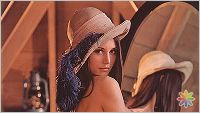|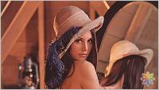|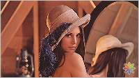|

**[\[⬆\]](#table-of-contents)**

## Compression

```O={value}```

Controls the output compression ratio (quality) of lossy file formats. Valid
values are in the range ```0 - 100```. The default value is depending on the
output file format, the used image request processor and the overall quality
parameter. If the image output file format supports lossless compression you
can set the value to ```100``` to enable lossless compression. For example,
WebP supports lossless image compression.

**Examples**

 ```/O=75/image.jpg```
 
 ```/F=WEBP/O=100/image.jpg```

|Source|Ratio 80%|Ratio 60%|Ratio 40%|
|------|---------|---------|---------|
|||||

**[\[⬆\]](#table-of-contents)**

## Resize

 ```S={params}```

Control the output dimension of your image.

**[\[⬆\]](#table-of-contents)**

### Image Width

 ```W{value}```
 
The width of the output image. Must be a positive integer greater than 0. The 
value is interpreted as a pixel width. The resulting image will be ```W```
pixels tall.

 ```W{value}P```
 
The width of the output image interpreted as a ratio in relation to the source 
image size. For example, a ```W``` value of 50 will result in an output image 
half the width of the input image.

If only one dimension is specified, the other dimension will be calculated 
according to the aspect ratio of the input image. If both width and height are 
omitted, then the input image's dimensions are used.

**Examples**

 ```/S=W320/image.jpg```
 
 ```/S=50P/image.jpg```

**[\[⬆\]](#table-of-contents)**

### Image Height

 ```H{value}```
 
The height of the output image. Must be a positive integer greater than 0. The 
value is interpreted as a pixel height. The resulting image will be ```H```
pixels wide.

 ```H{value}P```

The height of the output image interpreted as a ratio in relation to the source 
image size. For example, a ```H``` value of 50 will result in an output image 
half the height of the input image.

If only one dimension is specified, the other dimension will be calculated 
according to the aspect ratio of the input image. If both width and height are 
omitted, then the input image's dimensions are used.

**Examples**

 ```/S=H480/image.jpg```
 
 ```/S=50P/image.jpg```

**[\[⬆\]](#table-of-contents)**

### Pixel Density

 ```DPR{value}```
 
Control the output density of your image. The device pixel ratio is used to 
easily convert between CSS pixels and device pixels. This makes it possible to 
display images at the correct pixel density on a variety of devices.

You must specify either a width, a height, or both for this parameter to work.

The default value is 1.

**Examples**

 ```/S=W320,DPR1.5/image.jpg```
 
 ```/S=W320,H480,DPR2/image.jpg```

**[\[⬆\]](#table-of-contents)**

### Resize Method

 ```Q{value}```
 
Control the scaling algorithm. Valid values are ```0 - 4```. The default value
is ```0```, which will automatically use the algorithm in order to get the best
looking scaled image in the least amount of time.

 ```1``` (balanced) is used to indicate that the scaling implementation should 
use a scaling operation balanced between spped and quality.

 ```2``` (speed) is used to indicate that the scaling implementation should 
 scale as fast as possible and return a result. For smaller images (800px in 
 size) this can result in noticeable aliasing.
 
 ```3``` (quality) is used to indicate that the scaling implementation should 
do everything it can to create as nice of a result as possible. This approach is
most important for smaller pictures (800px or smaller) and less important for 
larger images.

 ```4``` (ultra quality) is used to make the image look exceptionally good at 
the cost of more processing and response time.

You must specify either a width, a height, or both for this parameter to work.

**Examples**

 ```/S=W320,Q2/image.jpg```
 
 ```/S=W320,DPR2,Q4/image.jpg```

**[\[⬆\]](#table-of-contents)**

### Resize Mode

 ```M{value}```

Control the resizing mode. Valid values are ```0 - 4```.

 ```0``` (automatic) is used to automatically calculate dimensions for the 
resultant image by looking at the image's orientation and generating 
proportional dimensions that best fit into the target width and height given.

 ```1``` (best fit both) is used to calculate dimensions for the largest image 
that fit within the bounding box, without cropping or distortion, retaining the 
original proportions.

 ```2``` (fit exact) is used to fit the image to the exact dimensions given 
regardless of the image's proportions. If the dimensions are not proportionally
correct, this will introduce vertical or horizontal stretching to the image.

 ```3``` (fit to width) is used to calculate dimensions for the resultant image 
that best-fit within the given width, regardless of the orientation of the 
image.

 ```4``` (fit to height) is used to calculate dimensions for the resultant image 
that best-fit within the given height, regardless of the orientation of the 
image.

You must specify either a width, a height, or both for this parameter to work.

**Examples**

 ```/S=W320,M2/image.jpg```
 
 ```/S=W320,H480,Q2,M4/image.jpg```

**[\[⬆\]](#table-of-contents)**

## Crop

 ```C={params}```
 
Controls how the input image is aligned. 

**[\[⬆\]](#table-of-contents)**

### X,Y Coordinates

Select a region of the image using the X,Y coordinate of the top left corner and 
the width & height of the region. This is useful for cropping images when you 
know the exact required pixel dimensions.

 ```X{value}```

Sets the X-Axis position of the top left corner of the crop. To be used in 
conjunction with ```Y```, ```W``` and ```H```.
 
 ```Y{value}```
 
Sets the Y-Axis position of the top left corner of the crop. To be used in 
conjunction with ```X```, ```W``` and ```H```.
 
 ```W{value}```
 
Sets the width of the crop. To be used in conjunction with ```X```, ```Y```
and ```H```.
 
 ```H{value}```
 
Sets the height of the crop. To be used in conjunction with ```X```, ```Y```
and ```W```.

**Examples**

 ```/C=X10,Y20/image.jpg```
 
 ```/C=X10,Y20,W200/image.jpg```
 
 ```/C=X10,Y20,W200,H100/image.jpg```

**[\[⬆\]](#table-of-contents)**
 
### Edge Mode

Specifies top, right, bottom, left values to trim the edges of an image. This is
useful for removing unwanted borders or whitespace.

 ```T{value}```
 
Top, to be used in conjunction with ```L```, ```R```, and ```B``` to allow 
cropping in from the edges of the image.
 
 ```L{value}```

Left, to be used in conjunction with ```L```, ```T```, and ```R``` to allow 
cropping in from the edges of the image.
 
 ```B{value}```

Bottom, to be used in conjunction with ```T```, ```R```, and ```B``` to allow 
cropping in from the edges of the image.
 
 ```R{value}```

Right, to be used in conjunction with ```L```, ```T```, and ```B``` to allow 
cropping in from the edges of the image.

**Examples**

 ```/C=T10/image.jpg```
 
 ```/C=T10,L10/image.jpg```
 
 ```/C=T10,L10,B20/image.jpg```
 
 ```/C=T10,L10,B20,R30/image.jpg```

**[\[⬆\]](#table-of-contents)**
 
### Square Crop

 ```SQ```
 
Select the largest square region from the center of the image. This sets the 
crop to a maximum size square area from the center of the image.

**Example**

 ```/C=SQ/image.jpg```

|Source|Square Crop|
|------|-----------|
||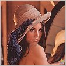|

**[\[⬆\]](#table-of-contents)**

### Aspect Ratio Crop

 ```AR{width}X{height}```

Select the largest area of given aspect ratio from the image. This sets the 
proportions of the area to be selected from the center of the image.

**Examples**

 ```/C=AR4X3/image.jpg```
 
 ```/C=AR16X9/image.jpg```

|Source|AR 4x3|
|------|------|
||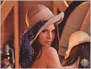|

**[\[⬆\]](#table-of-contents)**

## Trim

 ```T={value}```
 
Trimming an image removes a uniform border around the image. The value will
specify the tolerance of the color around the edge of the image. Valid values
are in the range ```0 - 10```.

> The operation will change the size of the source image.

**Examples**

 ```/T=5/image.jpg```

|Source|Trim Tolerance 5|
|------|----------------|
|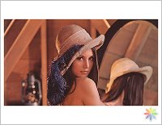|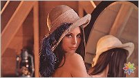|

**[\[⬆\]](#table-of-contents)**

## Rotation

 ```R={value}```
 
Rotate and flip your image. Valid values, to flip the image horizontally or
vertically are ```H``` or ```V```. To change the orientation you can set the
value to ```L``` to rotate the image 90 degrees clockwise, ```LR``` or ```RL```
to rotate the image 180 degrees clockwise or ```R``` to rotate the image 270
degrees clockwise.

**Examples**

 ```/R=H/image.jpg```
 
 ```/R=V/image.jpg```
 
 ```/R=L/image.jpg```
 
 ```/R=LR/image.jpg```
 
 ```/R=R/image.jpg```

**[\[⬆\]](#table-of-contents)**
 
## Effects

 ```E={params}```
 
Apply styles and effects to your image.

**[\[⬆\]](#table-of-contents)**

### `Antialias (Blur)`

 ```A```
 
Applies a very light gaussian style blur to your output image that acts like an 
anti-aliasing filter (softens the image a bit).

**Example**

 ```/E=A/image.jpg```

|Source|Destination|
|------|-----------|
|||

**[\[⬆\]](#table-of-contents)**

### Brightness

 ```B``` or ```B({value})```

Adjusts the brightness of the image. Must be a positive integer greater than 0.
The default value is ```10```.

**Examples**

 ```/E=B/image.jpg```
 
 ```/E=B(5)/image.jpg```

|Source|Destination|
|------|-----------|
|||

**[\[⬆\]](#table-of-contents)**

### Darkness

 ```D``` or ```D({value})```

Adjusts the darkness of the image. Must be a positive integer greater than 0.
The default value is ```10```.

**Examples**

 ```/E=D/image.jpg```
 
 ```/E=D(5)/image.jpg```

|Source|Destination|
|------|-----------|
|||

**[\[⬆\]](#table-of-contents)**

### Sharpen

 ```S```
 
Sharpens the image details using a convolution filter.
 
**Example**

 ```/E=S/image.jpg```

|Source|Destination|
|------|-----------|
|||

**[\[⬆\]](#table-of-contents)**

### Grayscale

 ```G```
 
Applies a grayscale color conversion.
 
**Example**

 ```/E=G/image.jpg```

|Source|Destination|
|------|-----------|
||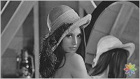|

**[\[⬆\]](#table-of-contents)**

### Grayscale Luminosity

 ```GL```
 
Applies a grayscale-luminosity color conversion. The luminosity method is a 
more sophisticated version of the average method. It also averages the values, 
but it forms a weighted average to account for human perception. We’re more 
sensitive to green than other colors, so green is weighted most heavily. 
 
**Example**

 ```/E=GL/image.jpg```

|Source|Destination|
|------|-----------|
|||

**[\[⬆\]](#table-of-contents)**

### Sepia Tone

 ```SP```
 
Applies a sepia toning effect to the image.
 
**Example**

 ```/E=SP/image.jpg```

|Source|Destination|
|------|-----------|
||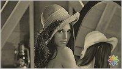|

**[\[⬆\]](#table-of-contents)**
 
### Sunset Tone

 ```SS```
 
Applies a sunset toning effect to the image.
 
**Example**

 ```/E=SS/image.jpg```

|Source|Destination|
|------|-----------|
||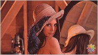|

**[\[⬆\]](#table-of-contents)**

### Invert

 ```I```
 
Inverts all the pixel colors and brightness values within the image producing a 
negative of the image.
 
**Example**

 ```/E=I/image.jpg```

|Source|Destination|
|------|-----------|
||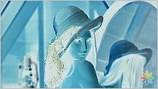|

**[\[⬆\]](#table-of-contents)**

### Threshold

 ```T({value})```
 
Valid values are in the range ```0 - 255```. The default value is ```127```.

**Examples**

 ```/E=T/image.jpg```
 
 ```/E=T(100)/image.jpg```

|Source|Destination|
|------|-----------|
||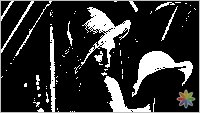|

**[\[⬆\]](#table-of-contents)**

### Posterize

 ```P```

**Example**

 ```/E=P/image.jpg```

|Source|Destination|
|------|-----------|
||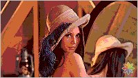|

**[\[⬆\]](#table-of-contents)**

### Pixelate

 ```PX({value})```
 
Applies a pixellation effect to the image. Valid values are in the 
range ```10 - 100```. The default value is ```10```.
 
**Examples**

 ```/E=PX/image.jpg```
 
 ```/E=PX(15)/image.jpg```

|Source|Destination|
|------|-----------|
||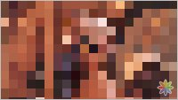|

**[\[⬆\]](#table-of-contents)**

### Noise

 ```N```

Applies a noise effect to the image.

**Example**

 ```/E=N/image.jpg```

|Source|Destination|
|------|-----------|
|||

**[\[⬆\]](#table-of-contents)**

### Gamma

 ```GAM({value})```
 
Adjusts gamma/midtone brightness. Valid values are in the range ```-100```
to ```100```. The default value is ```0``` which leaves the image unchanged.

**Example**

 ```/E=GAM(25)/image.jpg```

|Source|Destination|
|------|-----------|
||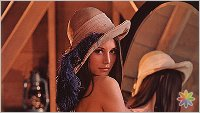|

**[\[⬆\]](#table-of-contents)**

### Auto Contrast

 ```AC```

**Example**

 ```/E=AC/image.jpg```

|Source|Destination|
|------|-----------|
|||

**[\[⬆\]](#table-of-contents)**

### Auto Level

 ```AL```

**Example**

 ```/E=AL/image.jpg```

|Source|Destination|
|------|-----------|
||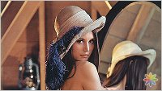|

**[\[⬆\]](#table-of-contents)**

### Auto Color

 ```AS```

**Example**

 ```/E=AS/image.jpg```

|Source|Destination|
|------|-----------|
|||

**[\[⬆\]](#table-of-contents)**

### Auto Enhancement

 ```AE```

Applies all three auto filters ```AC```, ```AL``` and ```AS``` which is equals
to ```/E=AC,AL,AS/image.jpg```.

**Example**

 ```/E=AE/image.jpg```

|Source|Destination|
|------|-----------|
||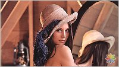|

**[\[⬆\]](#table-of-contents)**

## Background
 
  ```BG={value}```
  
Control the background color of your image. The background color to use when 
transparency is encountered. Valid values are 6-value (rgb) hexadecimal colors.
The default value is ```FFFFFF```.

**Example**

 ```/F=JPG/BG=336699/image.png```

**[\[⬆\]](#table-of-contents)**