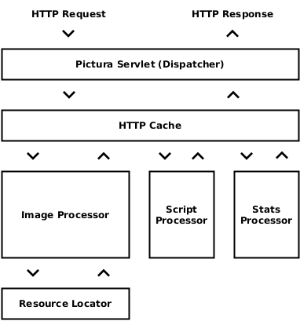

# PicturaIO Image Servlet API Reference

PicturaIO is designed around a dispatcher servlet (`PicturaServlet`) that handles
all the image requests and responses. The image request processing workflow of
the `PicturaServlet` is illustrated in the following diagram:

<p align="center">
    
</p>

After receiving an HTTP request, `PicturaServlet` consults the built-in HTTP
cache (if enabled). If the response for the given request was already rendered
and is still valid, the HTTP cache will directly write out a copy of the cached
image data.

If there is no valid cached instance available, the `PicturaServlet` will 
delegate the HTTP request to the responsible `RequestProcessor` to handle the
request.

In cases of an image request, the image processor will take help from the
available `ResourceLocator`'s *(1..n)* to pickup the origin image to process
for the request.

Once the image process is done, the `PicturaServlet` passes the image data to
the client (e.g. browser).

**Required Configuration**

You need to map image requests that you want the `PicturaServlet` handle, by
using a URL mapping in the `web.xml` file. The following is an example to show 
declaration and mapping for the default `PicturaServlet`:

```xml
<web-app ...>
    ...
    <servlet>
        <servlet-name>PicturaServlet</servlet-name>
        <servlet-class>io.pictura.servlet.PicturaServlet</servlet-class>
        <async-supported>true</async-supported>
        <load-on-startup>1</load-on-startup>
    </servlet>
    <servlet-mapping>
        <servlet-name>PicturaServlet</servlet-name>
        <url-pattern>/pictura/*</url-pattern>
    </servlet-mapping>
    ...
</web-app>
```

## Table of Contents

  1. [Servlet Types](#servlet-types)
  1. [Servlet Parameters](#servlet-parameters)
  1. [Context Parameters](#context-parameters)
  1. [Servlet Status & Statistics](#servlet-status-statistics)
  1. [ImageIO Support](#imageio-support)
  1. [IIO Registry Context Listener](#iio-registry-context-listener)
  1. [Cache Control Handler](#cache-control-handler)
  1. [Request Processors](#request-processors)
  1. [Request Processor Factory](#request-processor-factory) 
  1. [Resource Locators](#resource-locators)
  1. [URL Connection Factory](#url-connection-factory)
  1. [Params Interceptor](#params-interceptor)
  1. [Image Interceptor](#image-interceptor)
  1. [HTTP Cache](#http-cache)
  1. [Annotations](#annotations)
  1. [Authentication](#authentication)

## Servlet Types
  
The PicturaIO web servlet is available in two different kinds. The default servlet
`io.pictura.servlet.PicturaServlet` to handle GET requests only and a POST 
variant `io.pictura.servlet.PicturaPostServlet` to handle GET and POST 
requests.

In cases of POST requests, the source image is not specified as part of the 
URL (location of the image) and is also not resolved by the server. The image 
to convert is given as POST body data as part of the request.

> POST requests are not cached.

**[\[⬆\]](#table-of-contents)**
  
## Servlet Parameters

The Pictura servlet supports property placeholders for init parameters. You can
use this feature to refer to system properties.

For example, the placeholder `${http.proxyPort}` will refer to 
`java.lang.System.getProperty("http.proxyPort")`. You can also define a
default value if the system property is not set with the `:` delimeter
`${http.proxyPort:8077}`. In this case the value after the delimeter is
used. 

> To override servlet configuration defaults, specify them in the init-params 
> while configuring the servlet in `web.xml`.

**[\[⬆\]](#table-of-contents)**

### debug

If set to `true`, the servlet enables automatically all available debug
output like additional debug response headers. The default value is `false`.

**[\[⬆\]](#table-of-contents)**

### jmxEnabled

If set to `true`, the servlet registers the available JMX beans for the
pictura servlet implementation. The default value is `false`.

**[\[⬆\]](#table-of-contents)**

### statsEnabled

If set to `true`, enables the internal statistics monitor. The statistics
response (JSON object) could be use to monitor a single servlet instance for
example, by an external tool like Nagios. The default value is `false`.

**[\[⬆\]](#table-of-contents)**

### statsPath

Sets the statistics monitor path, relative to the servlet path. The default
value is `/stats`.

**[\[⬆\]](#table-of-contents)**

### statsIpAddressMatch

Sets the statistics monitor access control. Multiple IP addresses are separated
by comma. The default value is `127.0.0.1,::1`.

**[\[⬆\]](#table-of-contents)**

### corePoolSize

Sets the core executor pool size. Must be a positive integer greater than 0.

**[\[⬆\]](#table-of-contents)**

### maxPoolSize

Sets the maximum allowed number of image processing threads. Must be a positive 
integer greater than 0.

**[\[⬆\]](#table-of-contents)**

### keepAliveTime

Sets the time limit in millis for which image processing threads may remain idle 
before being terminated. Must be a positive integer greater than 0. If there are 
more than the core number of image processing threads currently in the pool, 
after waiting this amount of time without processing a task, excess threads will 
be terminated. The default value is `60000`.

**[\[⬆\]](#table-of-contents)**

### workerQueueSize

Sets the capacity of the worker queue. Must be a positive integer greater than 
0. The default value is `100`.

**[\[⬆\]](#table-of-contents)**

### workerTimeout

Sets the timeout in millis for a image request process. Must be a positive 
integer greater than 0. The default value is `60000`.

**[\[⬆\]](#table-of-contents)**

### resourcePaths

Sets the allowed image resource paths. Multiple paths are separated by comma.
The default value is `/*`.

**[\[⬆\]](#table-of-contents)**

### resourceLocators

Sets the used resource locators (class name). Multiple paths are separated by
comma. The default value is `io.pictura.servlet.FileResourceLocator`.

Default Resource Locators:

  1. `io.pictura.servlet.FileResourceLocator`
  1. `io.pictura.servlet.HttpResourceLocator`
  1. `io.pictura.servlet.EmptyResourceLocator`
 
**Example**

```xml
<web-app ...>
...
    <servlet>
        ...
        <init-param>
            <param-name>resourceLocators</param-name>
            <param-value>
                io.pictura.servlet.FileResourceLocator,
                io.pictura.servlet.HttpResourceLocator
            </param-value>
        </init-param>
    </servlet>
...
</web-app>
```

> See also [Resource Locators](#resource-locators)

**[\[⬆\]](#table-of-contents)**

### requestProcessor

Sets the default image request processor (class name). The default value is
`io.pictura.servlet.ImageRequestProcessor`.

**[\[⬆\]](#table-of-contents)**
 
### requestProcessorFactory

Sets the custom image request processor factory (class name). As default, this
value is not set.

> See also [Request Processor Factory](#request-processor-factory) 

**[\[⬆\]](#table-of-contents)**

### requestProcessorStrategy

Sets the custom image request processor strategy (class names). Multiple
strategies are separated by comma. The strategies are executed in the configured
order. As default, this value is not set.

Default Image Request Strategies:

  1. `io.pictura.servlet.ClientHintRequestProcessor`
  1. `io.pictura.servlet.AutoFormatRequestProcessor`
  1. `io.pictura.servlet.CSSColorPaletteRequestProcessor`
  1. `io.pictura.servlet.BotRequestProcessor`
  1. `io.pictura.servlet.PDFRequestProcessor` 1)
  1. `io.pictura.servlet.MetadataRequestProcessor` 1)

> 1) requires optional dependencies. For more details, please see
> [Request Processors](#request-processors).

**Example**

```xml
<web-app ...>
...
    <servlet>
        ...
        <init-param>
            <param-name>requestProcessorStrategy</param-name>
            <param-value>
                io.pictura.servlet.BotRequestProcessor,
                io.pictura.servlet.CSSColorPaletteRequestProcessor,
                io.pictura.servlet.ClientHintRequestProcessor,
                io.pictura.servlet.AutoFormatRequestProcessor
            </param-value>
        </init-param>
    </servlet>
...
</web-app>
```

**[\[⬆\]](#table-of-contents)**

### maxImageFileSize

Sets the maximum allowed file size in bytes for input images. Must be a positive
integer greater than 0. The default value is `2M`.

**[\[⬆\]](#table-of-contents)**

### maxImagePostContentLength

Sets the maximum allowed content length in bytes for POST requests. Must be
positive integer or `-1` to use the same value of `maxImageFileSize`.

> Required for `io.pictura.servlet.PicturaPostServlet`

**[\[⬆\]](#table-of-contents)**

### maxImageResolution

Sets the maximum allowed image resolution (width x height) in px for input 
images. Must be a positive integer greater than 0. The default value 
is `6000000` (6MP).

**[\[⬆\]](#table-of-contents)**

### maxImageEffects

Sets the maximum allowed number of image effects per request. Must be a positive
integer or `-1` to set to infinite. The default value is `5`.

**[\[⬆\]](#table-of-contents)**

### enabledInputImageFormats

Sets the allowed input image formats. Multiple values are comma separated. As 
default this is not set.

**Example**

```xml
<web-app ...>
...
    <servlet>
        ...
        <init-param>
            <param-name>enabledInputImageFormats</param-name>
            <param-value>JPG,PNG,WEBP,GIF,BMP</param-value>
        </init-param>
    </servlet>
...
</web-app>
```

**[\[⬆\]](#table-of-contents)**

### enabledOutputImageFormats

Sets the allowed output image formats. Multiple values are comma separated. As 
default this is not set.

**Example**

```xml
<web-app ...>
...
    <servlet>
        ...
        <init-param>
            <param-name>enabledInputImageFormats</param-name>
            <param-value>JPG,PNG,WEBP</param-value>
        </init-param>
    </servlet>
...
</web-app>
```

**[\[⬆\]](#table-of-contents)**

### enableBase64ImageEncoding

Enables or disables *Base64* image encoding (output). The default value
is `false`.

**[\[⬆\]](#table-of-contents)**

### imageioSpiFilterInclude

Sets the ImageIO plugin include filter. If set, only listed plugin SPI's
are loaded by the servlet instance. Multiple values are comma separated. As 
default, this value is not set.

```xml
<web-app ...>
...
    <servlet>
        ...
        <init-param>
            <param-name>imageioSpiFilterInclude</param-name>
            <param-value>
                com.sun.imageio.plugins.jpeg.JPEGImageReaderSpi,                
                com.github.jaiimageio.jpeg2000.impl.J2KImageWriterSpi
            </param-value>
        </init-param>
    </servlet>
...
</web-app>
```

**[\[⬆\]](#table-of-contents)**

### imageioSpiFilterInclude

Sets the ImageIO plugin exclude filter. If set, listed plugin SPI's are not
loaded by the servlet instance. Multiple values are comma separated. As default, 
this value is not set.

```xml
<web-app ...>
...
    <servlet>
        ...
        <init-param>
            <param-name>imageioSpiFilterInclude</param-name>
            <param-value>com.github.jaiimageio.jpeg2000.impl.J2KImageWriterSpi</param-value>
        </init-param>
    </servlet>
...
</web-app>
```

**[\[⬆\]](#table-of-contents)**

### imageioUseCache

Sets a flag indicating whether a disk-based cache file should be used when 
creating image input stream's and image output stream's. The default value
is `false`.

**[\[⬆\]](#table-of-contents)**

### imageioCacheDir

Sets the directory where cache files are to be created. The default value is
system depending. If `imageioUseCache` is `false`, this value is ignored.

**[\[⬆\]](#table-of-contents)**

### httpAgent

Overrides the default HTTP client user agent string for external requests.

**[\[⬆\]](#table-of-contents)**

### httpConnectTimeout

Sets a specified timeout value, in milliseconds, to be used when opening a 
communications link to an external resource. Must be a positive integer. A 
timeout of zero is interpreted as an infinite timeout. The default value 
is `5000`.

**[\[⬆\]](#table-of-contents)**

### httpReadTimeout

Sets the read timeout to a specified timeout, in milliseconds. Must be a 
positive integer. A timeout of zero is interpreted as an infinite timeout. The 
default value is `5000`.

**[\[⬆\]](#table-of-contents)**

### httpFollowRedirects

Sets whether HTTP redirects  (requests with response code 3xx) should be 
followed. The default value is `true`.

**[\[⬆\]](#table-of-contents)**

### httpMaxForwards

Sets the maximum number of forwards by proxies or gateways. Must be a integer.
A value of -1 is interpreted as infinite. The default value is `-1`.

**[\[⬆\]](#table-of-contents)**

### httpsDisableCertificateValidation

If set to `true`, the default HTTP client will disable certificate 
validation. The default value is `false`.

**[\[⬆\]](#table-of-contents)**

### httpProxyHost

Sets the optional proxy hostname. As default, this value is not set.

**[\[⬆\]](#table-of-contents)**

### httpProxyPort

Sets the proxy port number if a proxy hostname is set. Must be a positive
integer. As default, this value is not set.

**[\[⬆\]](#table-of-contents)**

### httpsProxyHost

Sets the optional **HTTPS** proxy hostname. As default, this value is not set.

**[\[⬆\]](#table-of-contents)**

### httpsProxyPort

Sets the **HTTPS** proxy port number if a proxy hostname is set. Must be a positive
integer. As default, this value is not set.

**[\[⬆\]](#table-of-contents)**

### urlConnectionFactory

Sets a custom URL connection factory (class name). As default, this value is
not set.

**Example**

```xml
<web-app ...>
...
    <servlet>
        ...
        <init-param>
            <param-name>urlConnectionFactory</param-name>
            <param-value>io.pictura.servlet.examples.CustomConnectionFactory</param-value>
        </init-param>
    </servlet>
...
</web-app>
```

```java
package io.pictura.servlet.examples;

import ...

public class CustomConnectionFactory implements URLConnectionFactory {
    @Override
    public URLConnection newConnection(URL url, Properties props) throws IOException {
        return (HttpURLConnection) url.openConnection();
    }
}
```

> See also [URL Connection Factory](#url-connection-factory)

**[\[⬆\]](#table-of-contents)**

### scriptEnabled

If set to `true` the client site JavaScript library is available by the
servlet instance. The default value is `true`.

**[\[⬆\]](#table-of-contents)**

### scriptPath

Sets the JavaScript library path, relative to the servlet path. The default
value is `/js`.

JavaScript Sources:

  1. `/js/pictura.js`
  1. `/js/pictura.min.js`
  1. `/js/cookie.js`
  1. `/js/cookie.min.js`
 
**[\[⬆\]](#table-of-contents)**

### placeholderProducerEnabled

If set to `true` the image placeholder producer will be enabled. The default
value is `false`.

**[\[⬆\]](#table-of-contents)**

### placeholderProducerPath

Sets the image placeholder producer path, relative to the servlet path. The 
default value is `/ip`.

**[\[⬆\]](#table-of-contents)**

### enableQueryParams

If set to `true`, enables Image API URL query parameters. The default value
is `false`.

**[\[⬆\]](#table-of-contents)**

### enableContentDisposition

If set to `true`, the image processor will append a content-disposition
response header if the request contains the `dl` URL query parameter.
The value of the query parameter must contains a valid filename. The default
servlet parameter value is `false`.

> Note, the filename suffix is automatically computed by the output image format.

**[\[⬆\]](#table-of-contents)**

### headerAddContentLocation

If set to `true`, the servlet appends automatically the origin content
location of remote located resources. The default value is `false`.

**[\[⬆\]](#table-of-contents)**

### headerAddTrueCacheKey

If set to `true`, the servlet appends automatically a true cache key for
each cache key to the responses. The default value is `false`.

**[\[⬆\]](#table-of-contents)**

### headerAddRequestId

If set to `true`, the servlet appends automatically a unique request ID 
each response. The default value is `false`.

**[\[⬆\]](#table-of-contents)**

### cacheControlHandler

Sets a custom cache control handler (class name or file). If a specified cache
control path matches for the request the specified directive is used as cache
control header. As default, this value is not set.

> See also [Cache Control Handler](#cache-control-handler)

**[\[⬆\]](#table-of-contents)**

### deflaterCompressionLevel

Sets the deflater compression level in cases of text resources (JS, CSS, ...).
Valid values are `0 - 9`. The default value is `8`.

**[\[⬆\]](#table-of-contents)**

### deflaterCompressionMinSize

Sets the minimum amount of data (in bytes) before the output is compressed. The 
default value is `1024`.

**[\[⬆\]](#table-of-contents)**

### cacheEnabled

If set to `true`, enables the embedded in-memory HTTP cache for image 
responses. The default value is `false`.

**[\[⬆\]](#table-of-contents)**

### cacheClass

Sets the custom HTTP cache (`io.pictura.servlet.HttpCache`) to use. As
default, this value is not set.

> If HTTP caching is enabled and there is no custom cache class set, the servlet
> will load an internal implementation. Please note, this implementation was
> not designed for production use.
> 
> See also [HTTP Cache](#http-cache)

**[\[⬆\]](#table-of-contents)**

### cacheCapacity

Sets the maximum size of a single cache entry in bytes for the built-in HTTP 
cache.

> Is respected only for the built-in HTTP cache.

**[\[⬆\]](#table-of-contents)**

### cacheMaxEntrySize

Sets the maximum number of possible cache entries in the built-in HTTP cache.

> Is respected only for the built-in HTTP cache.

**[\[⬆\]](#table-of-contents)**

### cacheFile

If set and if caching is enabled, the servlet will persist the current state
of the HTTP cache on destroing and restore on initialization of the servlet
instance. The value must be a valid absolute file path. As default, this value 
is not set.

> The server process requires read and write permissions on the specified path.

**[\[⬆\]](#table-of-contents)**

### configFile

An optional path to an external (XML or Properties) configuration file. As 
default this value is not set.

**Example**

```xml
<web-app ...>
...
    <servlet>
        ...
        <init-param>
            <param-name>configFile</param-name>
            <param-value>pictura.xml</param-value>
        </init-param>
    </servlet>
...
</web-app>
```

*XML Format*

```xml
<pictura>
...
    <debug>true</debug>
    ...
    <resource-locators>
        <class>io.pictura.servlet.FileResourceLocator</class>
        <class>io.pictura.servlet.HttpResourceLocator</class>
    </resource-locators>
...
</pictura>
```

> See `/META-INF/resources/dtd/pictura-config-1.0.dtd` for the document type
> definition.

*Properties Format*

```properties
io.pictura.servlet.debug=true
io.pictura.servlet.resourceLocators=io.pictura.servlet.FileResourceLocator,io.pictura.servlet.HttpResourceLocator
```

> A init parameter is specified as `io.pictura.servlet.{PARAM_NAME}`.

If both configurations contains a servlet init parameter (web.xml and the
external referenced config file), the value from the web.xml will override
the value from the external config file.

**[\[⬆\]](#table-of-contents)**

## Context Parameters

### io.pictura.servlet.LOG_LEVEL

Sets the log level for the internal Pictura servlet logger. Valid values are
`TRACE`, `DEBUG`, `INFO`, `WARN`, `ERROR` and `FATAL`. The default value is `INFO`.

> The intention of an internal servlet logger is that there maybe problems with 
> different logging frameworks on the running app server. So the internal logger
> copies the style JCL and will automatically try to log to an available JCL or 
> SLF4J. If both fails, the logs will be written to the default servlet context.

**[\[⬆\]](#table-of-contents)**

## Servlet Status &amp; Statistics

If enabled (see servlet parameters) the servlet provides status and statistic
values as JSON output. The default path (relativ to servlet path) is `/stats`.

**Example Output**

```javascript
{
    id: "mYXmkYVdpIoBGUY5",
    version: "1.0.0.Final",
    servlet: "pictura-demo",
    implClass: "io.pictura.examples.UndertowServletContainer$InterceptableServlet",
    implVersion: "1.0",
    uptime: "01h 29m 15s",
    alive: true,
    async: true,
    contextPath: "/pictura",
    executor: {
        poolSize: 4,
        queueSize: 0,
        activeCount: 0,
        taskCount: 38,
        completedTaskCount: 38,
        rejectedTaskCount: 0,
        instanceHours: 0.019666946
    },
    cache: {
        size: 89,
        hitRate: 0.94521
    },
        network: {
        outbound: 19721106,
        inbound: 4951087,
    },
    throughput: {
        requestsPerSecond: 16.987,
        averageResponseTime: 0.8712895,
        averageResponseSize: 5187
    },
    errorRate: 0.68421054
}
```

**[\[⬆\]](#table-of-contents)**

### Query Parameters

#### q (Query)

Specifies the query to execute. Valid values are `stats`, `errors`, `params`, 
`imageio` and `cache`. The default value (if parameter is not present) is `stats`.

**[\[⬆\]](#table-of-contents)**

#### f (Filter)

An optional parameter to specify a regular expression filter. Depends on the
query. 

**[\[⬆\]](#table-of-contents)**

#### a (Action)

An optional action parameter to specify an action to execute (e.g. delete 
cache entry).

**[\[⬆\]](#table-of-contents)**

### Example Queries

**Example 1**

List the cumulative numbers of all client and server errors since start.

*Request*

 `/stats?q=errors`

*Response*

```javascript
{
    http400: 26,
    http415: 1,
    http500: 3
}
```

**Example 2**

List the cumulative numbers of all server errors since start.

*Request*

 `/stats?q=errors&f=5.*`

*Response*

```javascript
{
    http500: 3
}
```

**Example 3**

List the servlet init parameters.

*Request*

 `/stats?q=params`

*Response*

```javascript
{
    initParams: {
        cacheCapacity: "100",
        cacheControlHandler: "io.pictura.examples.UndertowServletContainer$CacheControl",
        cacheEnabled: "true",
        debug: "true",
        enableBase64ImageEncoding: "true",
        enableContentDisposition: "true",
        enabledOutputImageFormats: "jpg,jp2,webp,png,gif",
        headerAddTrueCacheKey: "true",
        httpAgent: "TEST",
        httpMaxForwards: "2",
        httpsDisableCertificateValidation: "true",
        jmxEnabled: "true",
        maxPoolSize: "4",
        placeholderProducerEnabled: "true",
        requestProcessorStrategy: "io.pictura.servlet.PDFRequestProcessor,io.pictura.servlet.AutoFormatRequestProcessor",
        resourceLocators: "io.pictura.servlet.FileResourceLocator,io.pictura.servlet.HttpResourceLocator",
        statsEnabled: "true",
        workerQueueSize: "100"
    }
}
```

> Note, this lists only the custom parameters however not parameters which
> are initialized with default values.

**Example 4**

List all registered ImageIO plug-ins.

*Request*

 `/stats?q=imageio`

*Response*

```javascript
{
    imageio: [
        {
            pluginClassName: "com.luciad.imageio.webp.WebPImageReaderSpi",
            description: "WebP Reader",
            vendorName: "Luciad",
            version: "1.0",
            formatNames: "WebP, webp",
            fileSuffixes: "webp",
            mimeTypes: "image/webp"
        },
        {
            pluginClassName: "com.sun.imageio.plugins.jpeg.JPEGImageReaderSpi",
            description: "Standard JPEG Image Reader",
            vendorName: "Oracle Corporation",
            version: "0.5",
            formatNames: "JPEG, jpeg, JPG, jpg",
            fileSuffixes: "jpg, jpeg",
            mimeTypes: "image/jpeg"
        },
        {
            pluginClassName: "com.sun.imageio.plugins.jpeg.JPEGImageWriterSpi",
            description: "Standard JPEG Image Writer",
            vendorName: "Oracle Corporation",
            version: "0.5",
            formatNames: "JPEG, jpeg, JPG, jpg",
            fileSuffixes: "jpg, jpeg",
            mimeTypes: "image/jpeg"
        },
        {
            pluginClassName: "com.luciad.imageio.webp.WebPImageWriterSpi",
            description: "WebP Writer",
            vendorName: "Luciad",
            version: "1.0",
            formatNames: "WebP, webp",
            fileSuffixes: "webp",
            mimeTypes: "image/webp"
        }
    ]
}
```

**Example 5**

List the current HTTP cache entries.

*Request*

 `/stats?q=cache`

*Response*

```javascript
{
    cacheEntries: [
        {
            key: "/pictura/lenna.jpg",
            eTag: "W\/\"5a442a9dff78527bb6f3f0bf951d4980\"",
            hits: 0,
            timestamp: "Sun Dec 06 13:24:03 CET 2015",
            expires: "Sun Dec 06 15:24:03 CET 2015",
            statusCode: 200,
            contentType: "image/jpeg",
            contentLength: 23425,
            producer: "io.pictura.servlet.PicturaPostServlet$PostRequestProcessor"
        }
    ]
}
```

**Example 5**

Delete all HTTP cache entries which contains the string `jpg` in the cache key.

*Request*

 `/stats?q=cache&f=.*jpg.*&a=delete`

*Response*

A list (JSON representation) of the deleted HTTP cache entries.

**[\[⬆\]](#table-of-contents)**

## ImageIO Support

The servlet uses the default Java ImageIO interface to read and write images
*(ImageIO uses a service lookup mechanism, to discover plug-ins at runtime)*.

**WebP**

https://bitbucket.org/luciad/webp-imageio

**JPEG 2000**

```xml
<dependency>
    <groupId>com.github.jai-imageio</groupId>
    <artifactId>jai-imageio-jpeg2000</artifactId>
    <version>1.3.0</version>
</dependency>
```

**JPEG *(CMYK Support)***

```xml
<dependency>
    <groupId>com.twelvemonkeys.imageio</groupId>
    <artifactId>imageio-jpeg</artifactId>
    <version>3.1.1.</version>
</dependency>
```

**PSD *(read-only)***

```xml
<dependency>
    <groupId>com.twelvemonkeys.imageio</groupId>
    <artifactId>imageio-psd</artifactId>
    <version>3.1.1.</version>
</dependency>
```

**TIFF**

```xml
<dependency>
    <groupId>com.twelvemonkeys.imageio</groupId>
    <artifactId>imageio-tiff</artifactId>
    <version>3.1.1.</version>
</dependency>
```

**PCX**

```xml
<dependency>
    <groupId>com.twelvemonkeys.imageio</groupId>
    <artifactId>imageio-pcx</artifactId>
    <version>3.1.1.</version>
</dependency>
```

**ICNS**

```xml
<dependency>
    <groupId>com.twelvemonkeys.imageio</groupId>
    <artifactId>imageio-icns</artifactId>
    <version>3.1.1.</version>
</dependency>
```

**PICT**

```xml
<dependency>
    <groupId>com.twelvemonkeys.imageio</groupId>
    <artifactId>imageio-pict</artifactId>
    <version>3.1.1.</version>
</dependency>
```

**JBIG2**

```xml
<repositories>
    <repository>
        <id>jbig2.googlecode</id>
        <name>JBIG2 ImageIO-Plugin repository at googlecode.com</name>
        <url>http://jbig2-imageio.googlecode.com/svn/maven-repository</url>
    </repository>
</repositories>

<dependency>
    <groupId>com.levigo.jbig2</groupId>
    <artifactId>levigo-jbig2-imageio</artifactId>
    <version>1.6.1</version>
</dependency> 
```

**DICOM**

https://github.com/dcm4che/dcm4che

**[\[⬆\]](#table-of-contents)**

## IIO Registry Context Listener

Because the Java ImageIO plugin registry (the IIORegistry) is **VM global**, 
it doesn't by default work well with servlet contexts. This is especially 
evident if you load plugins from the `WEB-INF/lib` or classes folder. Unless 
you add `ImageIO.scanForPlugins()` somewhere in your code, the plugins might 
never be available at all.

If you restart your application, old classes will by default remain in memory 
forever (because the next time `scanForPlugins` is called, it's another 
`ClassLoader` that scans/loads classes, and thus they will be new instances in 
the registry). If a read is attempted using one of the remaining "old" readers, 
weird exceptions (like `NullPointerException`s when accessing `static final` 
initialized fields or `NoClassDefFoundError`s for uninitialized inner classes) 
may occur.

To work around both the discovery problem and the resource leak, it is **strongly 
recommended** to use the `io.pictura.servlet.IIOProviderContextListener` that 
implements dynamic loading and unloading of Java ImageIO plugins for web 
applications.

```xml
<web-app ...>
...
    <listener>
        <display-name>ImageIO Service Provider Loader/Unloader</display-name>
        <listener-class>io.pictura.servlet.IIOProviderContextListener</listener-class>
    </listener>
...
</web-app>
```

**[\[⬆\]](#table-of-contents)**

## Cache Control Handler

The cache control handler returns the cache control directive (header value) for 
the specified resource path.

You have two options to define a custom cache control handler, use an external
(XML) configuration file which contains the rules or write your own cache
control handler implementation.

**[\[⬆\]](#table-of-contents)**

### Configuration File

The rules from the configuration file are checked in the given order. You can
also use regular expressions and wild-cards to specify the path rules.

```xml
<cache-control>
    <!--
        Cache external resources for 10 min.
    -->
    <rule>
        <path>http*</path>
        <directive>public; max-age=600</directive>
    </rule>
    
    <!--
        For everything else set to 5 min.      
    -->
    <rule>
        <path>/*</path>
        <directive>public; max-age=300</directive>
    </rule>
</cache-control>
```

> See ```/META-INF/resources/cache-control-1.0.dtd``` for the document type
> definition.

```xml
<web-app ...>
...
    <servlet>
        ...
        <init-param>
            <param-name>cacheControlHandler</param-name>
            <param-value>cache-control.xml</param-value>
        </init-param>
    </servlet>
...
</web-app>
```

**[\[⬆\]](#table-of-contents)**

### Custom Implementation

A custom cache control handler implementation must implements the 
interface `io.pictura.servlet.CacheControlHandler`.

```java
package io.pictura.servlet.examples;

import ...

public class CacheControlHandlerImpl implements CacheControlHandler {

    @Override
    public String getDirective(String path) {
        if (path != null && !path.isEmpty()) {
        
            // Handle external resources
            if (path.startsWidth("http")) {
            
                // This will also override any cache control directive which
                // was set by the origin server where the resource comes from.
                return "public; max-age=600"; // 10 min.
            } 
            
            // Handle internal resources
            else {
                return "public; max-age=300"; // 5 min.
            }
        }
        return null; // no cache control
    }
}
```

```xml
<web-app ...>
...
    <servlet>
        ...
        <init-param>
            <param-name>cacheControlHandler</param-name>
            <param-value>io.pictura.servlet.examples.CacheControlHandlerImpl</param-value>
        </init-param>
    </servlet>
...
</web-app>
```

**[\[⬆\]](#table-of-contents)**

## Request Processors

The API defines a set of predefined image processors as well as strategies. You
can use the request processors to configure the default request processor a
strategy or to reuse in a custom request processor factory. For this, please see
the servlet init parameters `requestProcessor`, `requestProcessorStrategy` and
`requestProcessorFactory`. On each new servlet request the PicturaIO servlet
will lookup a new image request processor in the following order:

 1. Request Processor Factory (`requestProcessorFactory`)
 1. Request Processor Strategy (`requestProcessorStrategy`)
 1. Default Request Processor (`requestProcessor`)

**[\[⬆\]](#table-of-contents)**

### io.pictura.servlet.ImageRequestProcessor

This is the default core image request processor. If nothing else is configured
this request processor is used.

> The default image request processor **doesn't** implements the strategy 
> interface `io.pictura.servlet.ImageRequestStrategy`.

**[\[⬆\]](#table-of-contents)**

### io.pictura.servlet.AutoFormatRequestProcessor

An output format content negotiation request processor to automatically decide 
the best image format for the requested client if no output format was set.
You achieved the best results if you keep sure that ImageIO plug-ins are
installed for the following output formats: `JPEG`, `JPEG2000`, `WEBP`, `PNG`
and `GIF`.

**Information about what image formats the browsers support**

| Browser               | JPEG | JPEG 2000 | WEBP | PNG | GIF |
|-----------------------|------|-----------|------|-----|-----|
| Apple Safari OSX      | YES  | YES       |      | YES | YES |
| Apple Safari iOS      | YES  | YES       |      | YES | YES | 
| Google Chrome         | YES  |           | YES  | YES | YES |
| Chromium              | YES  |           | YES  | YES | YES |
| Android (4+)          | YES  |           | YES  | YES | YES |
| Opera                 | YES  |           | YES  | YES | YES |
| Mozilla Firefox       | YES  |           |      | YES | YES |
| Microsoft IE          | YES  |           |      | YES | YES |
| Microsoft Edge        | YES  |           |      | YES | YES |

> Implements the `io.pictura.servlet.ImageRequestStrategy` interface.

**[\[⬆\]](#table-of-contents)**

### io.pictura.servlet.ClientHintRequestProcessor

Based on the new Client-Hint browser feature or the Pictura Client-Hint Cookie 
Script, the processor will try to automatically negotiate the content.

If the image resource width is known at request time, the user agent can
communicate it to the server to enable selection of an optimized resource.
The client and server can negotiate an optimized asset based on the given
request hints.

For browsers which doesn't support client hint headers, it is possible to
enable this feature by passing values from client to the server via
a small cookie. To enable this feature it is necessary to embedd the
`cookie.js` script into the head of the HTML page.

> Implements the `io.pictura.servlet.ImageRequestStrategy` interface.

**[\[⬆\]](#table-of-contents)**

### io.pictura.servlet.CSSColorPaletteRequestProcessor

The CSS color palette processor is used to extract 1 - 32 dominant colors from 
the specified image (after the optional image operations are done). The result 
is given as `text/css`.

Also this type of request processor extends the default parameter set from the
default image request processor.

For more details, please see [Palette CSS API Reference](servlet/doc/pcss-api_en.md).

> Implements the `io.pictura.servlet.ImageRequestStrategy` interface.

**[\[⬆\]](#table-of-contents)**
 
### io.pictura.servlet.BotRequestProcessor

This is a special implementation of the default image request processor which 
will handle bot requests different to normal "user" requests.

The difference compared to normal "users" is that a bot will always get the
origin image unless it is a proxy request anyway. To handle this, the bot
request processor will send a moved permanently status code with the location 
to the unmodified image back to the client (bot).

> Implements the `io.pictura.servlet.ImageRequestStrategy` interface.

**[\[⬆\]](#table-of-contents)**

### io.pictura.servlet.MetadataRequestProcessor

> Requires the optional dependencies `com.drewnoakes:metadata-extractor` and 
> `com.google.code.gson:gson`. For the first use (request), the request 
> processor will check whether the dependencies are available or not.

Produces a non-image, **JSON** file format. This is a data representation of 
the image specified (EXIF values).

The image processor strategy is listening for requested `EXIF` output file 
formats (`/F=EXIF/image.jpg`).

**Example Response**

```javascript
{
    Photoshop: {
        MacPrintInfo: "[120 bytes]",
        ResolutionInfo: "100.0x100.0 DPI",
        PrintFlags: "0 0 0 0 0 0 0 0",
        CopyrightFlag: "No",
        PrintFlagsInformation: "0 1 0 0 0 0 0 0 0 2",
        ColorHalftoningInformation: "[72 bytes]",
        ColorTransferFunctions: "[112 bytes]",
        GridandGuidesInformation: "0 0 0 1 0 0 2 64 0 0 2 64 0 0 0 0",
        Photoshop4.0Thumbnail: "JpegRGB, 128x72, Decomp 27648 bytes, 1572865 bpp, 3458 bytes",
        JPEGQuality: "8 (High), Standard format, 3 scans"
    },
    JPEG: {
        CompressionType: "Baseline",
        DataPrecision: "8 bits",
        ImageHeight: "225 pixels",
        ImageWidth: "400 pixels",
        NumberofComponents: "3",
        Component1: "Y component: Quantization table 0, Sampling factors 1 horiz/1 vert",
        Component2: "Cb component: Quantization table 1, Sampling factors 1 horiz/1 vert",
        Component3: "Cr component: Quantization table 1, Sampling factors 1 horiz/1 vert"
    },
    JpegComment: {
        JPEGComment: "File written by Adobe Photoshop 4.0"
    },
    AdobeJPEG: {
        DCTEncodeVersion: "1",
        Flags0: "0",
        Flags1: "0",
        ColorTransform: "YCbCr"
    },
    JFIF: {
        Version: "1.2",
        ResolutionUnits: "inch",
        XResolution: "100 dots",
        YResolution: "100 dots"
    }
}
```

> Implements the `io.pictura.servlet.ImageRequestStrategy` interface.

**[\[⬆\]](#table-of-contents)**

### io.pictura.servlet.PDFRequestProcessor

> Requires the optional dependency `org.apache.pdfbox:pdfbox`. For the 
> first use (request), the request processor will check whether the dependency 
> is available or not. 

Produces a non-image, **PDF** file format. The actual image will be part of
the generated PDF document.

The image processor strategy is listening for requested `PDF` output file 
formats `/F=PDF/image.jpg`).

**[\[⬆\]](#table-of-contents)**

## Request Processor Factory

A custom image request processor factory must implements the interface
`io.pictura.servlet.ImageRequestProcessorFactory`. The following example
demonstrates the usage of a custom image request processor factory. If a
request contains the HTTP header `X-JPEG`, the factory will create a
custom image request processor which creates JPEG output images only, independent
from the specified format parameter.

> If you deal with dynamic client values like cookies, do not forget to 
> override the `getTrueCacheKey() : String` method to prevent caching
> errors.

**Example**

```java
package io.pictura.servlet.examples;

import ...

public class ImageRequestProcessorFactoryImpl implements ImageRequestProcessorFactory {
    
    @Override
    public ImageRequestProcessor createRequestProcessor(HttpServletRequest req) throws ServletException {
        if (req.getHeader("X-JPEG") != null) {
            return new JpegOnlyImageRequestProcessor();
        }
        return new ImageRequestProcessor();
    }
    
    public static final JpegOnlyImageRequestProcessor extends ImageRequestProcessor {
    
        @Override
        protected String getRequestedFormatName(HttpServletRequest req) {
            return "jpg";
        }
    }
}
```

Do not forget to set the servlet init parameter *requestProcessorFactory*,
otherwise the factory is not used by the Pictura servlet instance.

```xml
<web-app ...>
...
    <servlet>
        ...
        <init-param>
            <param-name>requestProcessorFactory</param-name>
            <param-value>io.pictura.servlet.examples.ImageRequestProcessorFactoryImpl</param-value>
        </init-param>
    </servlet>
...
</web-app>
```

**[\[⬆\]](#table-of-contents)**

## Resource Locators

A resource locator is used to locate a requested resource (image). In this 
connection it is irrelevant where the resource is located; for example on the 
local disk or on a remote location. In any case, each resource locator returns
a valid URL which will contains the full qualified path to the requested 
resource or `null` if the resource can't be located by the resource locator.

As default (if nothing else was configured), the servlet will register a
`io.pictura.servlet.FileResourceLocator` with the root path of your web
application. To customize the root path, you can implement and register your
own resource locator.

**Example 1**

File resource locator with resource path annotation.

```java
package io.pictura.servlet.examples;

import ...

@ResourcePath("/cms/content/static/images")
public class CustomFileResourceLocator extends FileResourceLocator {
}
```

> The resource path value must be an absolute file path.

**Example 2**

Multiple resource paths.

```java
package io.pictura.servlet.examples;

import ...

public class CustomFileResourceLocator extends FileResourceLocator {

    @Override
    protected String getRootPath() {
        return "/cms/content/static/images-1" 
            + File.pathSeparator 
            + "/cms/content/static/images-2";
    }
}
```

**Example 3**

Check source media type.

```java
package io.pictura.servlet.examples;

import ...

public class CustomFileResourceLocator extends FileResourceLocator {

    @Override
    protected boolean validate(File f) {
        if (super.validate(f)) {
            // Only allow jpeg images
            if (f.getAbsolutePath().endsWidth(".jpg")) {
                return true;
            }
        }
        return false;
    }
}
```

**Example 4**

Protect the source domain of remote located image files.

```java
package io.pictura.servlet.examples;

import ...

public class ProtectedHttpResourceLocator extends HttpResourceLocator {

    @Override
    public URL getResource(String path) throws MalformedURLException {
        if (path != null && path.startsWith("/tblr")) {
            return super.getResource("http://tumblr.com" + path.replaceFirst("/tblr", ""));
        }
        return null;
    }
}
```

**[\[⬆\]](#table-of-contents)**

## URL Connection Factory

You can create customized URL Connections to fetch remote located image 
resources if you register your own URL Connection Factory via the servlet init
parameter `urlConnectionFactory`.

If `newConnection(URL, Properties)` is called from an image request processor,
the properties list contains the configured HTTP client connection settings as 
described in the following table.

|Property                                                 |Description|
|---------------------------------------------------------|-----------|
|`io.pictura.servlet.HTTP_CONNECT_TIMEOUT`                |A specified timeout value, in milliseconds, to be used when opening a communications link to the resource referenced by the URL object.|
|`io.pictura.servlet.HTTP_READ_TIMEOUT`                   |The read timeout to a specified timeout, in milliseconds.|
|`io.pictura.servlet.HTTP_MAX_FORWARDS`                   |A integer value to set the max-forwards.|
|`io.pictura.servlet.HTTP_FOLLOW_REDIRECTS`               |A boolean value to specifies whether HTTP redirects (requests with response code 3xx) should be automatically followed.|
|`io.pictura.servlet.HTTP_AGENT`                          |Specifies a custom user-agent string.|
|`io.pictura.servlet.HTTPS_DISABLE_CERTIFICATE_VALIDATION`|A boolean value to disable the HTTPS certificate validation.|
|`io.pictura.servlet.HTTP_PROXY_HOST`                     |The hostname, or address, of the proxy server.|
|`io.pictura.servlet.HTTP_PROXY_PORT`                     |The port number of the proxy server.|
|`io.pictura.servlet.HTTPS_PROXY_HOST`                    |The hostname, or address, of the proxy server (used by the HTTPS protocol handler).|
|`io.pictura.servlet.HTTPS_PROXY_PORT`                    |The port number of the proxy server (used by the HTTPS protocol handler).|

**Example 1**

Add a custom request header.

```java
package io.pictura.servlet.examples;

import ...

public class CustomConnectionFactory implements URLConnectionFactory {

    @Override
    public URLConnection newConnection(URL url, Properties props) throws IOException {
        // Use the default factory to create an URLConnection with the default
        // settings (e.g. timeout, certificate validation, etc.)
        URLConnectionFactory factory = URLConnectionFactory.DefaultURLConnectionFactory.getDefault();
        URLConnection connection = factory.newConnection(url, props);
        
        // Add custom request header
        connection.setRequestProperty("X-Header-Name", "Header-Value");
        
        return connection;
    }
}
```

**Example 2**

Basic authentication request.

```java
package io.pictura.servlet.examples;

import ...

public class CustomConnectionFactory implements URLConnectionFactory {

    @Override
    public URLConnection newConnection(URL url, Properties props) throws IOException {
        // Use the default factory to create an URLConnection with the default
        // settings (e.g. timeout, certificate validation, etc.)
        URLConnectionFactory factory = URLConnectionFactory.DefaultURLConnectionFactory.getDefault();
        URLConnection connection = factory.newConnection(url, props);
        
        // Condition
        if (url.toExternalForm().startsWith("http://example.com/")) {
            String userPassword = "username" + ":" + "password";
            connection.setRequestProperty("Authorization", "Basic " + Base64.encodeBase64(userPassword.getBytes()));
        }
        
        return connection;
    }
}
```

**[\[⬆\]](#table-of-contents)**

## Params Interceptor

> Please note, you can set params interceptors only with the corresponding 
> annotation or programmatically if you override the `doProcess(...)`
> method from the `PicturaServlet` class.

Could be used to intercept and modify the request image parameters before the
image will be processed. The following example will remove all defined image
effects and set the pixelate effect depending on a developer defined condition.

**Example**

```java
package io.pictura.servlet.examples;

import ...

@WebServlet(...)
@PicturaParamsInterceptor(PaywallInterceptor.class)
public class InterceptablePicturaServlet extends PicturaServlet {
    
    private static final long serialVersionUID = -1L;
    
    public static final class PaywallInterceptor implements ParamsInterceptor {
        
        @Override
        public String getVaryCacheKey(String trueCacheKey, HttpServletRequest req) {
            if (hasPaid(req)) {
                return trueCacheKey;
            }
            return trueCacheKey + ... ;
        }

        @Override
        public Map<String, String> intercept(Map<String, String> params, HttpServletRequest req) {
            // Add pixelate effect to the response image if the user has not yet paid
            if (!hasPaid(req)) {
                params.put("e", "px");                
            }
            return params;
        }

        private boolean hasPaid(HttpServletRequest req) {
            return ... ;
        }
    }
}
```

**[\[⬆\]](#table-of-contents)**

## Image Interceptor

> Please note, you can set image interceptors only with the corresponding 
> annotation or programmatically if you override the `doProcess(...)`
> method from the `PicturaServlet` class.

Could be used to intercept and modify an image before the image will be encode 
and write out to the response stream. The following example will render a
watermark image to each output image (bottom right corner).

> If you have *1..n* image interceptors, the interceptors are called in the
> specified order.

**Example**

Add a small watermark to the bottom right corner of each image.

```java
package io.pictura.servlet.examples;

import ...

@PicturaImageInterceptor(WatermarkInterceptor.class)
public class WatermarkServlet extends PicturaServlet {
    
    private static final long serialVersionUID = -1L;
    
    public static final class WatermarkInterceptor implements ImageInterceptor {
        
        private BufferedImage watermark;
        
        static {
            watermark = ImageIO.read(...);
        }
        
        @Override
        public String getVaryCacheKey(String trueCacheKey, HttpServletRequest req) {
            return trueCacheKey;
        }
        
        @Override
        public BufferedImage intercept(BufferedImage img, HttpServletRequest req) {
            if (img.getWidth() >= 10 && img.getWidth() >= 10) {
                int w = watermark.getWidth() > watermark.getHeight()
                    ? watermark.getWidth() : watermark.getHeight();			

                float i = Math.max(8, (img.getWidth() / 10f));

                BufferedImage wm = watermark;
                if (w > i) {
                    wm = Pictura.resize(watermark, Pictura.Method.AUTOMATIC,
                            Pictura.Mode.FIT_EXACT, Math.round(i), Math.round(i));
                }

                // Bottom-Right
                int x = img.getWidth() - Math.round(1.2f * wm.getWidth());
                int y = img.getHeight() - Math.round(1.2f * wm.getHeight());

                Graphics2D g = (Graphics2D) img.getGraphics();

                g.setRenderingHint(RenderingHints.KEY_ANTIALIASING,
                        RenderingHints.VALUE_ANTIALIAS_ON);

                int rule = AlphaComposite.SRC_OVER;
                Composite comp = AlphaComposite.getInstance(rule, 0.65f);
                g.setComposite(comp);

                g.drawImage(wm, x, y, null);
                g.dispose();
            }
            return img;
        }
    }
}
```

**[\[⬆\]](#table-of-contents)**

## HTTP Cache

The servlet comes with an embedded in-memory HTTP cache to speed up delivery 
time and reduce server side resource consumption. 

Normally, application servers comes with there own in-memory cache API's, e.g. 
JBoss and WildFly uses the **Infinispan** cache. To enable the usage of 
the server default cache implementation, it is necessary to implement and 
register your own wrapper class.

**Example 1** (Infinispan)

```java
package io.pictura.servlet.examples;

import ...

public class InfinispanHttpCache implements HttpCache {

    private static final int CAPACITY = 1000;
    private static final long MAX_ENTRY_SIZE = 1024 * 1024 * 2; // 2MB
    
    private final Cache<String, SoftReference<HttpCacheEntry>> cache;
    
    public InfinispanHttpCache() {
        EmbeddedCacheManager manager = new DefaultCacheManager();
        manager.defineConfiguration("pictura-http-cache", new ConfigurationBuilder()
                .eviction().strategy(LRU).maxEntries(CAPACITY).build());
                
        this.cache = manager.getCache("pictura-http-cache");
        this.cache.start();
    }
    
    public void stop() {
        cache.stop();
    }
    
    @Override
    public HttpCacheEntry get(String key) {
        SoftReference<HttpCacheEntry> ref = cache.get(key);
        return ref != null ? ref.get() : null;
    }
    
    @Override
    public void put(String key, HttpCacheEntry entry) {
        if (MAX_ENTRY_SIZE > 0 && entry != null && entry.getContentLength() > MAX_ENTRY_SIZE) {
            return;
        }
        if (entry == null) {
            remove(key);
        } else {
            cache.put(key, new SoftReference<>(entry));
        }
    }
    
    @Override
    public boolean remove(String key) {
        return cache.remove(key) != null;
    }
    
    @Override
    public Set<String> keySet() {
        return Collections.unmodifiableSet(new ConcurrentSkipListSet<>(cache.keySet()));
    }
}
```

```xml
<web-app ...>
...
    <servlet>
        ...
        <init-param>
            <param-name>cacheEnabled</param-name>
            <param-value>true</param-value>
        </init-param>
        <init-param>
            <param-name>cacheClass</param-name>
            <param-value>io.pictura.servlet.examples.InfinispanHttpCache</param-value>
        </init-param>
    </servlet>
...
</web-app>
```

> Keep sure that responses from external resources contains an `Expires` or 
> `Cache-Control` header. In cases of local file resources it is necessary 
> to define a custom `io.pictura.servlet.CacheControlHandler`, too.

**Example 2** *(Shared Cache)*

If you register a `HttpCache` to your PicturaIO servlet instance, you can't
share this cache between different servlet or server instances by default. This
is because the servlet creates always a new (empty) cache instance for each servlet
instance. A shared cache could be helpful if you have *2..n* servlet instances
or server processes with a load balancer in front.

You can solve this, if you register your shared cache instance programmatically
instead of the servlet config:

```java
public class SharedHttpCachePicturaServlet extends PicturaServlet {        
    @Override
    public void init(ServletConfig config) throws ServletException {
        super.init(config);            
        // Get or create a instance of your shared cache
        HttpCache sharedCacheInstance = ...            
        // Register the shared cache instance
        setHttpCache(sharedCacheInstance);
    }
}
```

For example, the `sharedCacheInstance` is a wrapped Infinispan `JCache` 
instance.

**[\[⬆\]](#table-of-contents)**

## Annotations

### @PicturaConfigFile

Annotation to set the path, relativ to `/WEB-INF` or as absolute path, to
the (optional) external configuration file.

**Example**

```java
package io.pictura.servlet.examples;

import ...

@WebServlet(...)
@PicturaConfigFile("pictura.xml")
public class ExternalConfigPicturaServlet extends PicturaServlet {
    
    private static final long serialVersionUID = -1L;
}
```

> In the example above, the configuration file is located at `/WEB-INF/pictura.xml`.

**[\[⬆\]](#table-of-contents)**

### @PicturaImageInterceptor

Annotation to intercept the image output (`BufferedImage`) with custom
extensions like watermarks, etc.

**Example**

```java
package io.pictura.servlet.examples;

import ...

@WebServlet(...)
@PicturaImageInterceptor({ImageBorderInterceptor.class, WatermarkInterceptor.class})
public class InterceptablePicturaServlet extends PicturaServlet {
    
    private static final long serialVersionUID = -1L;
    
    public static final class WatermarkInterceptor implements ImageInterceptor {
        ...
    }
    
    public static final class ImageBorderInterceptor implements ImageInterceptor {
        ...
    }
}
```

> The interceptors are processed in the specified order.

**[\[⬆\]](#table-of-contents)**

### @PicturaParamsInterceptor

Annotation to intercept the image request parameters.

```java
package io.pictura.servlet.examples;

import ...

@WebServlet(...)
@PicturaParamsInterceptor(PaywallInterceptor.class)
public class InterceptablePicturaServlet extends PicturaServlet {
    
    private static final long serialVersionUID = -1L;
    
    public static final class PaywallInterceptor implements ParamsInterceptor {
        ...
    }
}
```

**[\[⬆\]](#table-of-contents)**

### @PicturaThreadFactory

Annotation to set a custom thread factory to process image requests.

**Example**

```java
package io.pictura.servlet.examples;

import ...

@WebServlet(...)
@PicturaThreadFactory(ServerThreadFactory.class)
public class ThreadFactoryPicturaServlet extends PicturaServlet {
    
    private static final long serialVersionUID = -1L;
    
    public static final class ServerThreadFactory implements ThreadFactory {
        
        @Override
        public Thread newThread(Runnable r) {
            Thread t = new Thread(...);
            t.setDaemon(true);
            t.setPriority(Thread.MIN_PRIORITY + 2);
            return t;
        }
    }
}
```

**[\[⬆\]](#table-of-contents)**

### @ResourcePath

Annotation to set the root path for customized `io.pictura.servlet.FileResourceLocator`'s.

**Example**

```java
package io.pictura.servlet.examples;

import ...

@ResourcePath("/cms/content/static/images")
public class CmsFileResourceLocator extends FileResourceLocator {
    ...
}
```

**[\[⬆\]](#table-of-contents)**

## Authentication

Authentication is done by the servlet-container. If you need it, you have to
add the appropriate sections to the `web.xml`.

**[\[⬆\]](#table-of-contents)**